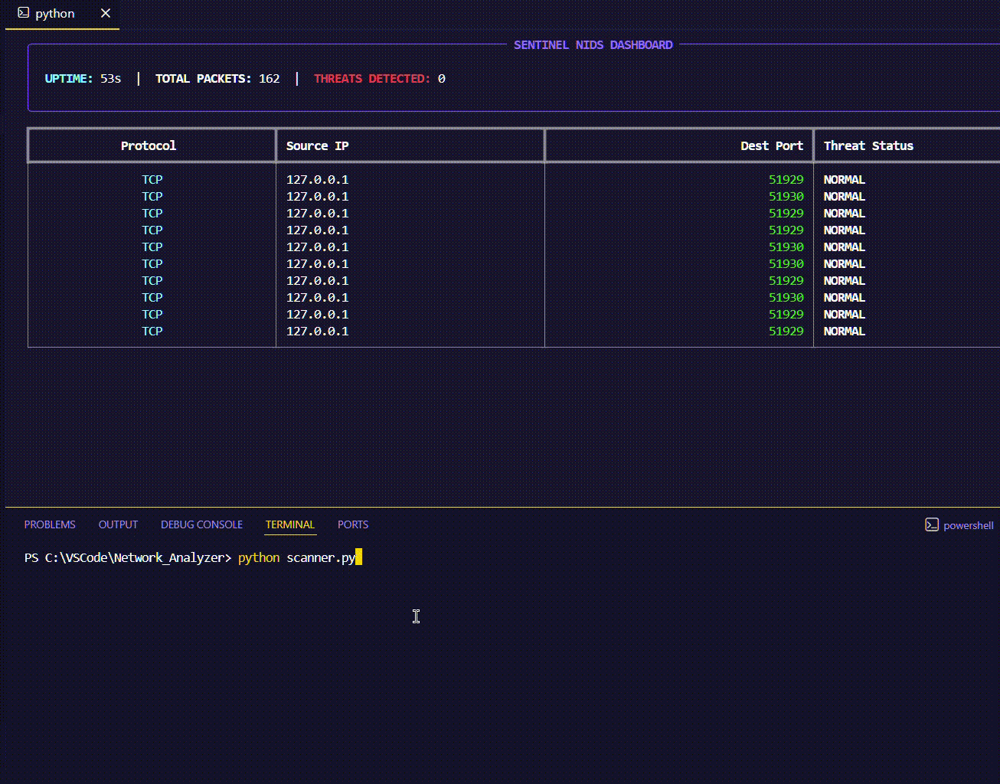

# 🛡️ Sentinel: Network Intrusion Detection System (NIDS)


Sentinel is a high-performance, real-time network sniffer and threat detector built in Python. Designed as an individual security project, it monitors network traffic, parses packet layers, and identifies malicious patterns like Port Scanning and Rate Flooding.

## 🚀 Features

- **Live TUI Dashboard:** A clean, real-time terminal interface using the `Rich` library.
- **Protocol Parsing:** Deep inspection of TCP, UDP, IPv4, and IPv6 layers.
- **Anomaly Detection:** - **Port Scan Detection:** Flags IPs hitting multiple unique ports within a time window.
  - **Rate Limiting:** Detects DoS attempts by tracking packet-per-second (PPS) thresholds.
- **Smart Logging:** Automatically saves detailed threat reports to `alerts.csv`.
- **Whitelisting:** Built-in protection to ignore trusted DNS and local gateway traffic.

## 📺 Live Demo



## 🛠️ Tech Stack

- **Language:** Python 3.13
- **Core Library:** [Scapy](https://scapy.net/) (Packet Manipulation)
- **UI Framework:** [Rich](https://github.com/Textualize/rich) (Terminal UI)
- **Driver:** Npcap (Windows Packet Capture)

## 📋 Installation & Setup

1. **Install Npcap:**
   Ensure [Npcap](https://nmap.org/npcap/) is installed (usually bundled with Wireshark or Nmap).

2. **Clone the Project:**

   ```bash
   git clone [https://github.com/Marauder-0/Network_Analyzer.git](https://github.com/Marauder-0/Network_Analyzer.git)
   cd Sentinel

   ```

3. **Install Dependencies**
   pip install -r requirements.txt

4. **Run as Administrator:**
   python main.py

## 🔍 How it Works

Sentinel operates by binding to a specific network interface (including the Npcap Loopback Adapter for local testing).

1. **Parser:** Extracts source/destination IPs and ports from raw frames.
2. **Detector:** Uses a sliding-window algorithm to track connection history.
3. **Logger:** If a threshold is crossed (e.g., >15 ports or >100 PPS), an alert is generated.

## 🧪 Testing the "Vibe"

To verify the detection logic without an external attacker, follow these steps:

1. **Configure the Target:** Open `scanner.py` in VS Code and update the `target_ip` variable to match your local IP (e.g., `127.0.0.1` for Loopback or your `192.168.x.x` address).
2. **Start the Monitor:** Run `main.py` as an Administrator. Ensure it is listening on the same interface as your target (e.g., `Npcap Loopback Adapter`).
3. **Trigger the Scan:** In a separate terminal, run:
   ```bash
   python scanner.py
   ```
